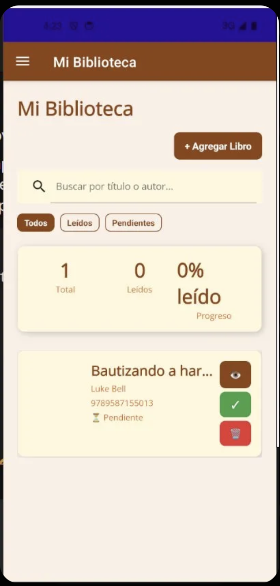

i# ProyectoFinalAppMoviles --> Biblioteca.mg


Una aplicación móvil intuitiva diseñada para que los amantes de la lectura puedan gestionar su catálogo personal de libros, realizar un seguimiento de su progreso y visualizar estadísticas de sus hábitos de lectura.

## 📝 Descripción del Proyecto

**Mi Biblioteca** permite a los usuarios centralizar la información de sus libros en un solo lugar. El proyecto se enfoca en la usabilidad y el seguimiento visual, permitiendo clasificar lecturas entre pendientes y terminadas, además de ofrecer una sección de métricas para motivar el hábito lector.

## Funcionalidades Implementadas

* **Gestión de Catálogo:** Visualización de libros con detalles como título, autor e ISBN.
* **Filtros Inteligentes:** Clasificación rápida por estado: *Todos*, *Leídos* y *Pendientes*.
* **Búsqueda Avanzada:** Buscador integrado para localizar libros por título, autor o código ISBN.
* **Panel de Estadísticas:** * Conteo total de libros y páginas leídas.
    * Porcentaje de progreso general.
    * Gráficos de distribución por género y estado de lectura.
* **Acciones Rápidas:** Botones para ver detalles, marcar como completado o eliminar libros de la lista.
* **Soporte de Temas:** Interfaz adaptable a modo claro y oscuro.

## Instrucciones de Ejecución

### Requisitos Previos
* [.NET SDK](https://dotnet.microsoft.com/download) (Versión 8.0 recomendada).
* IDE: Visual Studio 2022 o VS Code con la extensión de C#.

### Pasos para correr el proyecto
1.  **Clonar el repositorio:**
    ```bash
    git clone [https://github.com/tu-usuario/nombre-del-repo.git](https://github.com/tu-usuario/nombre-del-repo.git)
    ```
2.  **Navegar al directorio del proyecto:**
    ```bash
    cd nombre-del-proyecto
    ```
3.  **Restaurar dependencias:**
    ```bash
    dotnet restore
    ```
4.  **Ejecutar la aplicación:**
    ```bash
    dotnet build
    dotnet run
    ```
    *(O presionar F5 en Visual Studio seleccionando el emulador/dispositivo deseado).*

## Screenshots

### Modo Light (Claro)
| Biblioteca | Estadísticas | Búsqueda |
| :---: | :---: | :---: |
|  |  |  |

### Modo Dark (Oscuro)
| Vista Principal | Gráficos de Datos |
| :---: | :---: |
|  |  |

---
